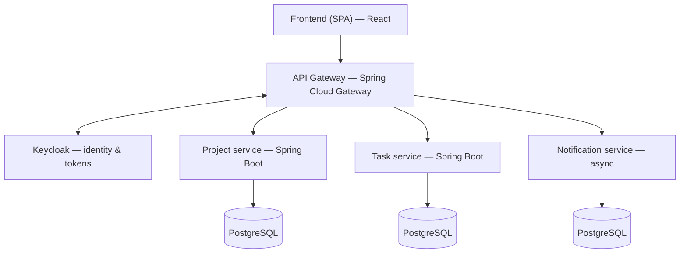

# TaskFlow — a full-stack task tracker

A small project-and-task management app (think mini Jira), built as a learning-driven portfolio project. It starts as a single Spring Boot + React application and is refactored, phase by phase, into an authenticated microservices system deployed to a live URL.

The goal is not just the finished app — it's a clean, visible engineering progression: monolith first, then real auth, then a proper service split. Each phase is independently runnable and shown as a checklist below.

## Overview

- Create and manage projects, add tasks, track their status.
- Users log in and only see what they're allowed to (role-based access).
- Backend exposes a REST API; frontend is a single-page app that consumes it.
- The whole system runs locally with a single `docker compose up`.

## Target architecture

The end-state design. Early phases implement a subset of this (see the roadmap).



## Tech stack

| Layer | Technology |
|-------|-----------|
| Frontend | React (Vite) |
| Backend | Java, Spring Boot, Spring Web, Spring Data JPA / Hibernate |
| Auth | Keycloak (OpenID Connect) |
| Gateway | Spring Cloud Gateway |
| Database | PostgreSQL |
| Packaging | Docker, Docker Compose |
| CI/CD | GitHub Actions |
| Deployment | Docker Compose on a VPS, Caddy for HTTPS |

## Roadmap

Built in phases. Every phase ends with something that runs and can be demoed.

**Phase 1 — Monolith**
- [ ] `GET /api/projects` returns JSON (hardcoded first, no DB)
- [ ] Connect PostgreSQL, persist projects and tasks with JPA
- [ ] Create / list projects and tasks via REST
- [ ] React frontend consuming the API
- [ ] Runs locally with Docker Compose
- [ ] Deployed to a live URL

**Phase 2 — Real authentication**
- [ ] Add Keycloak, replace basic login
- [ ] Configure realm, client, and roles
- [ ] Protect API endpoints with OIDC tokens
- [ ] Frontend login flow through Keycloak

**Phase 3 — Microservices**
- [ ] Extract task logic into its own service
- [ ] Add Spring Cloud Gateway in front
- [ ] Route and secure traffic through the gateway
- [ ] Service-to-service communication

**Phase 4 — Polish & stretch**
- [ ] CI/CD pipeline with GitHub Actions
- [ ] Notification service with a message queue (async)
- [ ] Observability (Spring Boot Actuator, logging)

## Getting started

Prerequisites: Java 21+, Node 20+, Docker.

```bash
# Start the database (and, in later phases, the full stack)
docker compose up -d

# Backend
cd backend
./mvnw spring-boot:run

# Frontend
cd frontend
npm install
npm run dev
```

The API runs on `http://localhost:8080`, the frontend on `http://localhost:5173`.

## Project structure

```
taskflow/
├── backend/            # Spring Boot application
├── frontend/           # React (Vite) single-page app
├── docker-compose.yml  # Postgres now; grows to the full stack in later phases
└── README.md
```

In Phase 3, `backend/` is split into `project-service/`, `task-service/`, and a `gateway/`. Keeping backend and frontend separate from day one makes that split a reorganization rather than a rewrite.

## Notes

This is a personal project built to refresh core Spring/full-stack skills and to learn the microservices, auth, and deployment pieces hands-on. Progress is tracked openly in the roadmap above.
